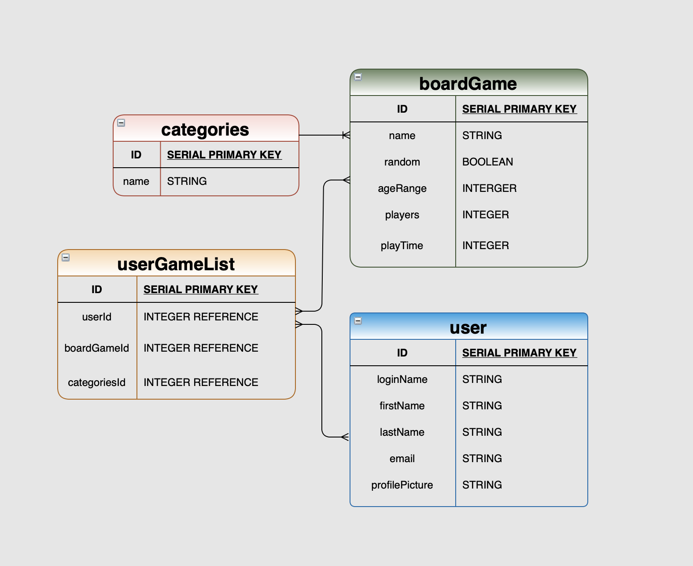

# RNJesus

- Board Game Tracker

## ERD



---

## User Stories

- As a user, I want to:
  - Search a game
  - Read more details about the game
- Be able to have a favorite list:
  - Add game to favorite list
  - remove game from favorite list
- Randomize a game

---

## Wireframes

### Home Route:


### Log In Route:


### User Profile Route:


### User Library Route:


### Search Page Route:


---

## Link to App

https://rnjesus.herokuapp.com

---

## How it works

RNJesus store board games data from an API, creates associations between the users and their favorite game list. There's also an option for the user to randomly generation a game to see if they would like to try out.

---

## Relationship between database

Database was created using the [Sequelize ORM](https://sequelize.org/). Join table was used to allow associations between foreign models, such as:

```js
models.Boardgame.belongsToMany(models.User, {
	through: 'Favoritelist',
	foreignKey: 'boardgameId'
})
```

Associations were also made within the User model:

```js
models.User.belongsToMany(models.Boardgame, {
	through: 'Favoritelist',
	foreignKey: 'userId'
})
```

---

## Seeding

The Seed files pull information from [the Board Game Atlas API](https://api.boardgameatlas.com/api) and populate database with all the relevant information.

The board game model was seeded by the method bellow. This will scrape the API and grab only the most relevant information for the User.

```js
const axios = require('axios')
const API_URL =
	'https://api.boardgameatlas.com/api/search?order_by=rank&ascending=false&client_id=s2XQYtohOX'
const dataArray = []
const fetchData = async () => {
	let dataUrl = API_URL
	const { data } = await axios.get(dataUrl)
	data.games.map((e) => {
		let dataObject = {
			name: e.name,
			image_url: e.image_url,
			min_age: e.min_age,
			min_players: e.min_players,
			max_players: e.max_players,
			min_playtime: e.min_playtime,
			max_playtime: e.max_playtime,
			description_preview: e.description_preview,
			createdAt: new Date().toISOString(),
			updatedAt: new Date().toISOString()
		}
		dataArray.push(dataObject)
	})
	return dataArray
}
```

The App also use a method to search the api to return the exact name of a game.

```js
const detailArray = []
const fetchDetail = async (name) => {
	try {
		let dataUrl = `https://api.boardgameatlas.com/api/search?name=${name}&limit=1&pretty=true&client_id=s2XQYtohOX`
		const { data } = await axios.get(dataUrl)
		data.games.map((e) => {
			let description = e.description
			if (e.description.includes('<p>')) {
				description = description.replace(/<p>/g, '')
			}
			if (e.description.includes('</p>')) {
				description = description.split('</p>')[0]
			}
			if (e.description.includes('<em>')) {
				description = description.replace(/<em>/g, '')
			}
			if (e.description.includes('</em>')) {
				let array = description.split('</em>')
				description = array.join('')
			}
			if (e.description.includes('<br />')) {
				let array = description.split('<br />')
				description = array.join('')
			}
			if (e.description.includes('&quot')) {
				description = description.replace(/&quot/g, '')
			}
			let dataObject = {
				name: e.name,
				image_url: e.image_url,
				min_players: e.min_players,
				max_players: e.max_players,
				min_playtime: e.min_playtime,
				max_playtime: e.max_playtime,
				min_age: e.min_age,
				description: description,
				user_rating: e.average_user_rating
			}
			detailArray.push(dataObject)
		})
		return detailArray
	} catch (error) {
		console.log('error', error)
	}
}
```

---

### RESTful Routing

The following table illustrates the routes that are used by the server to allow a user to navigate between views and interact with the database.

| Verb   | URL          | Action          | Description                                           |
| ------ | ------------ | --------------- | ----------------------------------------------------- |
| GET    | /            | Index (Read)    | Main page                                             |
| GET    | /auth/login  | login (Read)    | Log in screen                                         |
| GET    | /auth/signup | signup (Read)   | Sign up screen for new account                        |
| GET    | /auth/logout | logout (Read)   | Log out of current account                            |
| POST   | /auth/login  | login (Create)  | Log in to an existing account                         |
| POST   | /auth/signup | signup (Create) | Sign up and log in                                    |
| GET    | /game        | display (Read)  | display board game                                    |
| GET    | /game/random | display (Read)  | Randomly select a game from API database              |
| GET    | /game/search | display (read)  | search through API database to display a game by name |
| GET    | /game/:id    | display (Read)  | display game information                              |
| POST   | /game/       | Create (Create) | add game to collection by id                          |
| DELETE | /game/       | Delete (Remove) | remove a game from user's collection                  |

An of route handle by the server from the game controller:

```js
// adding data into database
router.post('/', isLoggedIn, async (req, res) => {
	try {
		const { id } = req.user.get()
		const {
			name,
			img_url,
			min_players,
			max_players,
			min_playtime,
			max_playtime,
			min_age,
			description
		} = req.body

		const createdGame = await Boardgame.create({
			name,
			img_url,
			min_players,
			max_players,
			min_playtime,
			max_playtime,
			min_age,
			description
		})

		const addGame = await Favoritelist.create({
			userId: id,
			recipeId: createdGame.id
		})

		res.redirect('/profile')
	} catch (error) {
		console.log(error)
		res.render('error')
	}
})
```

---

## The Views

The examples bellow is a code snippet from game/favorite view. This block of code handles what is being display on the favorite route:

```js
<link rel="stylesheet" href="/css/style.css" />

<% for (let i=0; i < games.length; i++) { %> <% let g = games[i] %>
<!-- card 1 -->
<div class="card">
	<div class="face face1">
		<div class="content">
			<p>
				<span><%= g.name %></span><br />
				Age: <%= g.min_age %>+ <br />
				Total players: between <%= g.min_players %> & <%= g.max_players %>
				<br />
				length: between: <%= g.min_playtime %> & <%= g.max_playtime %> minutes
				<br />
			</p>
			<form method="POST" action="/game/<%= g.id %>/?_method=DELETE">
				<input type="submit" value="Delete" id="bttn" class="deletebttn" />
			</form>
		</div>
	</div>
	<div class="face face2">
		<h2>
			" width="200" height="200" />
		</h2>
	</div>
</div>
<% } %>

```

---

## Installation Instructions

If you want your own copy of RNJesus:

- Fork and clone [this repo](https://github.com/Siegfer/RNJesus.git)
- Install the necessary packages:
  - `npm install`
- Migrate:
  - `sequelize db:migrate`
- Seed with the following command in your cloned directory.
  - `sequelize db:seed --seed 20210910031429-create-boardgame`
- Visit your [local host port 3000](http://localhost:3000/) to begin!
